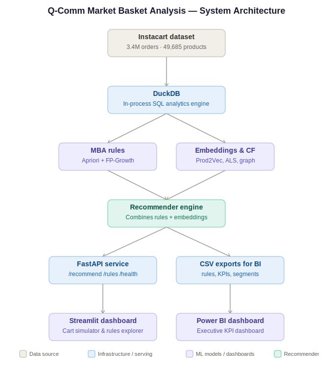

# Q-Comm Market Basket Analysis

> End-to-end market basket analysis and recommendation system inspired by Zepto, Blinkit, and Instamart — built on 3.4M Instacart orders, from raw data to a deployed recommendation API and executive BI dashboard.



---

## Project overview

This project simulates the data science workflow behind a quick-commerce "you might also need" recommendation feature. It covers the full pipeline: exploratory data analysis, classical association rule mining (Apriori, FP-Growth), advanced recommendation models (Prod2Vec embeddings, ALS collaborative filtering, graph community detection), a real-time recommendation API, and two dashboards — an interactive Streamlit app and an executive Power BI report.

**Why this matters for quick-commerce:** unlike traditional retail with large weekly baskets, q-comm baskets are small (5-10 items) and purchased in minutes. This requires lower statistical thresholds for association rules, strong temporal segmentation (a 7am basket looks nothing like a 11pm basket), and recommendations that respond in milliseconds.

---

## Key results

| Metric | Value |
|---|---|
| Orders analyzed | 3.4M |
| Unique users | 206K |
| Unique products | 49,685 |
| Average basket size | 10.09 items |
| Overall reorder rate | 58.97% |
| Association rules discovered | 99 |
| Strongest rule (quality-filtered, lift ≥ 1.5, support ≥ 0.005) | Beverages + personal care → household (lift 2.35x) |
| Apriori runtime (department level, 21 categories) | 5.32s |
| FP-Growth runtime (department level) | 17.40s |

**A note on the headline "53x lift" figure shown in the Power BI dashboard:** this comes from extremely low-support item pairs (a handful of co-occurring orders out of 3.4M). It is mathematically correct but not statistically robust on its own — the working rules table applies a `support >= 0.001` filter to surface associations backed by meaningful sample sizes. Both numbers are shown deliberately: the unfiltered max demonstrates the long tail of niche associations, while the filtered table drives actual recommendation logic.

---

## Architecture

The pipeline has four stages:

1. **Data layer** — Instacart's 2017 dataset (orders, products, departments, aisles) loaded into DuckDB for fast, in-process SQL analytics on 33M+ order-item rows.
2. **Modeling layer** — two parallel approaches:
   - *Association rules*: Apriori and FP-Growth at department and SKU level, filtered by support/confidence/lift
   - *Embeddings & collaborative filtering*: Prod2Vec (Word2Vec on purchase sequences), ALS matrix factorization, and graph-based community detection on the product co-occurrence network
3. **Recommendation engine** — combines rule-based and embedding-based scores into a single ranked recommendation list per cart.
4. **Serving layer** — a FastAPI service exposing `/recommend`, `/rules`, and `/health` endpoints, consumed by a Streamlit dashboard; in parallel, batch CSV exports feed a Power BI executive dashboard.

---

## Project phases

- [x] **Phase 1 — Data foundation & EDA**: DuckDB pipeline, 8 EDA visualizations (basket size distribution, temporal heatmaps, reorder rates, department share, co-occurrence)
- [x] **Phase 2 — Apriori & FP-Growth**: transaction encoding, algorithm benchmarking, 99 SKU-level association rules
- [x] **Phase 3 — Q-comm segmentation**: temporal slicing (time-of-day demand), occasion-based basket clustering, reorder pattern analysis
- [x] **Phase 4 — Advanced models**: Prod2Vec product embeddings, ALS collaborative filtering, graph community detection on the co-occurrence network
- [x] **Phase 5 — Serving layer**: FastAPI recommendation API, Streamlit interactive dashboard, Power BI executive dashboard (4 pages)
- [x] **Phase 6 — Portfolio polish**: architecture diagram, final README, resume-ready summary

---

## Repository structure

```
qcomm-market-basket-analysis/
├── data/
│   ├── raw/                  # Instacart CSVs (gitignored - download from Kaggle)
│   ├── processed/            # DuckDB database, generated rules (gitignored)
│   └── powerbi/              # CSV exports for the Power BI dashboard
├── notebooks/
│   ├── 01_eda.ipynb                    # Phase 1: EDA
│   ├── 02_apriori_fpgrowth.ipynb       # Phase 2: association rule mining
│   ├── 03_segmentation.ipynb           # Phase 3: temporal & occasion segmentation
│   ├── 04_advanced_models.ipynb        # Phase 4: Prod2Vec, ALS, graph analysis
│   └── 05_export_for_powerbi.ipynb     # Power BI data export
├── src/
│   ├── data/
│   │   └── loader.py          # DuckDB connection + table loading
│   ├── recommender/
│   │   └── engine.py           # Combines MBA rules + Prod2Vec scores
│   ├── api/
│   │   ├── main.py             # FastAPI app entrypoint
│   │   ├── routes.py           # /recommend, /rules, /health
│   │   └── models.py           # Pydantic request/response schemas
│   └── dashboard/
│       └── app.py              # Streamlit dashboard
├── outputs/
│   ├── figures/                # EDA and analysis charts (PNG)
│   └── dashboard.pdf           # Power BI dashboard export
├── qcomm_mba_dashboard.pbix     # Power BI source file
├── architecture_diagram.svg
├── export_powerbi.py
├── run.py                       # API entrypoint (waitress server)
├── requirements.txt
└── README.md
```

---

## Tech stack

**Data & analytics**: Python 3.12, DuckDB, pandas, NumPy, matplotlib, seaborn
**Association rules**: mlxtend (Apriori, FP-Growth)
**Advanced models**: gensim (Prod2Vec / Word2Vec), implicit (ALS), NetworkX (graph community detection)
**Serving**: FastAPI, Pydantic, waitress
**Dashboards**: Streamlit, Power BI Desktop
**Tooling**: Jupyter Lab, Git/GitHub

---

## Setup and usage

### 1. Clone and set up environment

```bash
git clone https://github.com/Avantika029/qcomm-market-basket-analysis.git
cd qcomm-market-basket-analysis

py -3.12 -m venv venv312
venv312\Scripts\activate        # Windows
# source venv312/bin/activate   # Mac/Linux

pip install --upgrade pip
pip install -r requirements.txt
```

### 2. Download the dataset

Download the [Instacart Market Basket Analysis dataset](https://www.kaggle.com/datasets/psparks/instacart-market-basket-analysis) from Kaggle and place the CSVs in `data/raw/`.

### 3. Run the notebooks in order

```bash
jupyter lab
```

Run `01_eda.ipynb` → `02_apriori_fpgrowth.ipynb` → `03_segmentation.ipynb` → `04_advanced_models.ipynb` → `05_export_for_powerbi.ipynb`

### 4. Start the recommendation API

```bash
python run.py
```

Visit `http://127.0.0.1:8000/docs` for interactive API documentation.

### 5. Start the Streamlit dashboard

```bash
streamlit run src/dashboard/app.py
```

Visit `http://localhost:8501`

### 6. Open the Power BI dashboard

Open `qcomm_mba_dashboard.pbix` in Power BI Desktop. The dashboard has 4 pages: Executive Overview, Customer Behavior, Demand Intelligence, and Market Basket Analysis.

---

## Methodology notes

**Why DuckDB?** It runs columnar SQL queries directly on CSV files with no server setup, making GROUP BY aggregations on 33M rows run in seconds rather than minutes with pandas alone.

**Why both Apriori and FP-Growth?** They produce identical results but differ in computational approach — Apriori prunes candidates using the anti-monotone property (effective on dense, low-dimensional data), while FP-Growth compresses transactions into a prefix tree (effective on sparse, high-dimensional data). At department level (21 categories, dense), Apriori ran 3x faster; at SKU level (49K products, sparse), FP-Growth is the better choice.

**Why lift over confidence?** Confidence alone is biased toward popular items — any rule pointing to a frequently-bought product will show high confidence regardless of genuine association. Lift normalizes by the consequent's baseline frequency, revealing whether the relationship is meaningful or just popularity.

**Why combine rules with embeddings?** Association rules are interpretable and precise but suffer from sparsity and cold-start (new products have no history). Prod2Vec embeddings generalize to the long tail by learning product similarity from purchase sequences. The recommender engine blends both signals for robustness.

---

## Author

Built by Avantika as an end-to-end portfolio project demonstrating the complete data science lifecycle — from raw data to production-style serving — for Data Analyst, Data Scientist, ML Engineer, and Product Analyst roles.

[GitHub](https://github.com/Avantika029/qcomm-market-basket-analysis)
